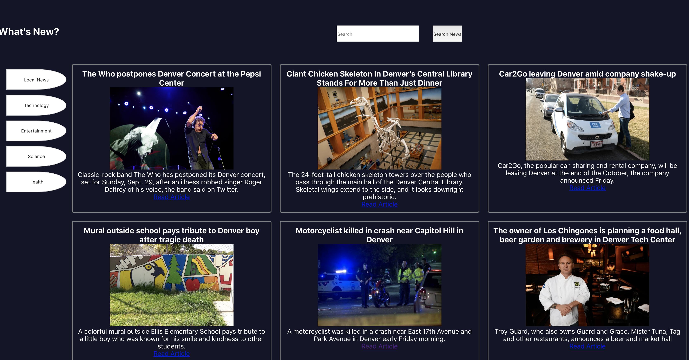
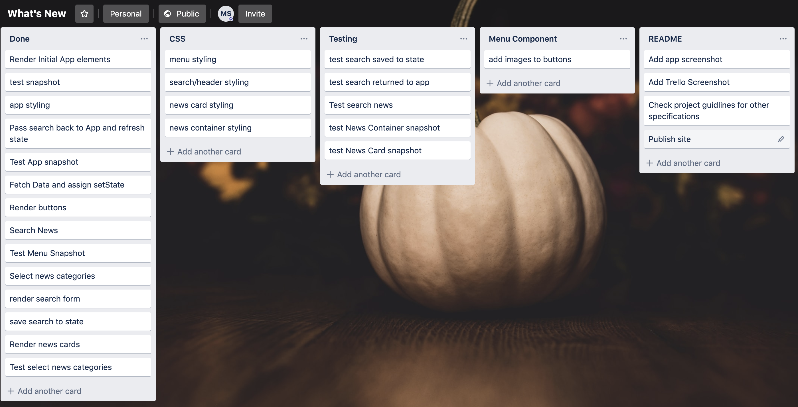

# What's New?

What's New is a news app built using React.  The user is able to browse different categories of news including local, health, entertainment, technology and science.

This application was built with `create-react-app`.

## Created by:
[Michael Schneider](https://github.com/mschneider247/whats-new)

### Set Up

Clone down the repo.  Once the repo has been cloned run npm install and then finally npm start to see the site

### Screenshots

